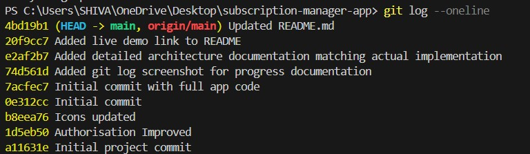

# Git Commit History

This project was developed over several hours as part of the 24-hour Shipsy AI Campus challenge. Below is the commit timeline showing iterative progress — from initial setup to final enhancements.

Each commit reflects real development work, including:
- Setting up authentication
- Implementing CRUD operations
- Adding pagination, filtering, and calculated fields
- Documenting AI usage
- Preparing for submission

All changes were made by me, with active use of Gemini CLI for prompt-assisted coding.

